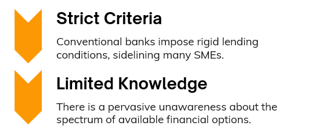

# Empowering Small and Medium Enterprises with Real-Time Funding Solutions

Small and Medium-sized Enterprises (SMEs) are pivotal to the global economy, yet they often struggle to secure necessary funding. This challenge, exacerbated by stringent traditional lending criteria and a low awareness of alternatives, stifles economic potential.

  

## Our Solution
The Digital Marketplace is engineered with blockchain and AI to revolutionize the SME-lender dynamic, offering a transparent and efficient pathway to diverse financing opportunities.

  

## Features

### Listing Finance Options
- Financiers can list detailed descriptions of their financing options.
- Includes online applications and foundational terms of service.

### Opportunity Posts
- SMEs can showcase lucrative business and investment opportunities.
- Include essential details like contact information and credit scores.
- Facilitates direct engagement between potential partners and investors.

### Blockchain Integration
- Ensures a foundation of trust and transparency.
- Enhances operational reliability of trade transactions within the marketplace.

 

# Flow Diagram 

  

# Wroking Process 

  

# Working Demo

## Working of GrowNet FlutterFlow Application (click the image to play the video)

## Working of Recomendation system  (click the image to play the video)

## Smart Contract for Agreements using blockchain (click the image to play the video)

## Smart Contract for  Transcations using blockchain (click the image to play the video)

## Tech Stack Used

### FlutterFlow

  

**1. Rapid Development:**
FlutterFlow allows for fast prototyping and development of the application. Its intuitive drag-and-drop interface enables rapid UI design, reducing the time required to build and iterate on the user interface.

**2. Visual Development:**
With FlutterFlow, we can visually design and develop complex user interfaces without writing extensive code. This approach simplifies the development process, making it accessible and efficient for both designers and developers.

**3. Integration with Flutter:**
FlutterFlow is built on top of Flutter, which means that the visual components created in FlutterFlow are directly translatable to Flutter code. This integration ensures that we can leverage Flutter’s powerful features and ecosystem while benefiting from a streamlined design process.

**4. Customizable and Scalable:**
FlutterFlow provides flexibility in customization and scalability. As the project evolves, we can easily add new features and refine the user interface, ensuring that the application can grow and adapt to changing requirements.

### Firebase

  

**1. Real-Time Database:**
Firebase Firestore offers a real-time NoSQL database that is perfect for applications requiring real-time data synchronization. This capability ensures that SMEs and lenders receive up-to-date information instantly, enhancing the user experience.

**2. Authentication and Security:**
Firebase Auth provides a robust authentication system that supports various authentication methods, including email/password, social media logins, and more. This feature ensures secure and seamless access for users while protecting sensitive data.

**3. Serverless Architecture:**
Firebase Functions enable us to implement serverless logic, such as processing transactions, handling notifications, and managing backend processes. This approach reduces the need for managing infrastructure, allowing us to focus on application logic and features.

**4. Scalable and Managed Infrastructure:**
Firebase’s managed infrastructure ensures that the application can scale effortlessly to handle increasing user loads. It abstracts the complexities of server management, allowing us to focus on building and improving the application.

**5. Analytics and Monitoring:**
Firebase offers integrated analytics and monitoring tools, such as Firebase Analytics and Crashlytics. These tools provide valuable insights into user behavior and application performance, helping us make data-driven decisions and improve the application.

By leveraging FlutterFlow for rapid and efficient UI development and Firebase for robust backend services, we can build a powerful, scalable, and user-friendly Digital Marketplace for SMEs. This combination of tools aligns perfectly with our goal of creating a seamless and efficient platform for connecting SMEs with financing opportunities.

### Blockchain with Solidity

  

**1. Smart Contracts:**
We use Solidity for developing smart contracts that handle various aspects of the platform’s transactions. Solidity is a powerful language specifically designed for Ethereum blockchain development.

**2. Transparency and Security:**
By leveraging smart contracts, we ensure transparency and security in all financial transactions. The use of blockchain technology guarantees that all transactions are immutable and verifiable.

**3. Integration:**
The smart contracts are integrated with the platform to handle finance listings, opportunity postings, and transaction executions securely and efficiently.

### Recommendation System with Content-Based Filtering

**1. Personalized Recommendations:**
Our recommendation system uses content-based filtering to provide personalized suggestions to users. This approach analyzes the features of items (e.g., business opportunities, financing options) and matches them with user preferences.

**2. Enhanced User Experience:**
Content-based filtering helps in delivering relevant recommendations based on individual user profiles and past interactions, improving the overall user experience on the platform.

**3. Implementation:**
The recommendation system is implemented using algorithms that evaluate item attributes and user preferences to generate tailored suggestions.

  

